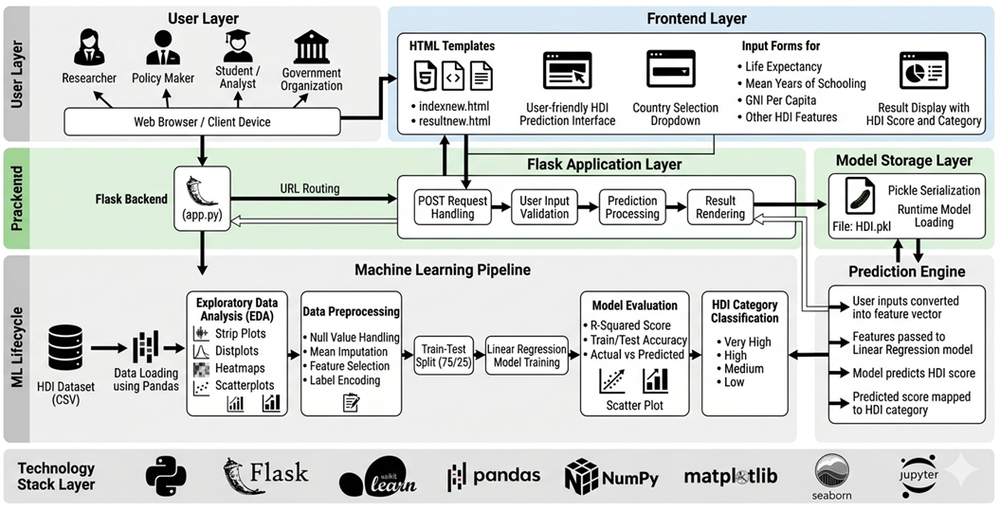
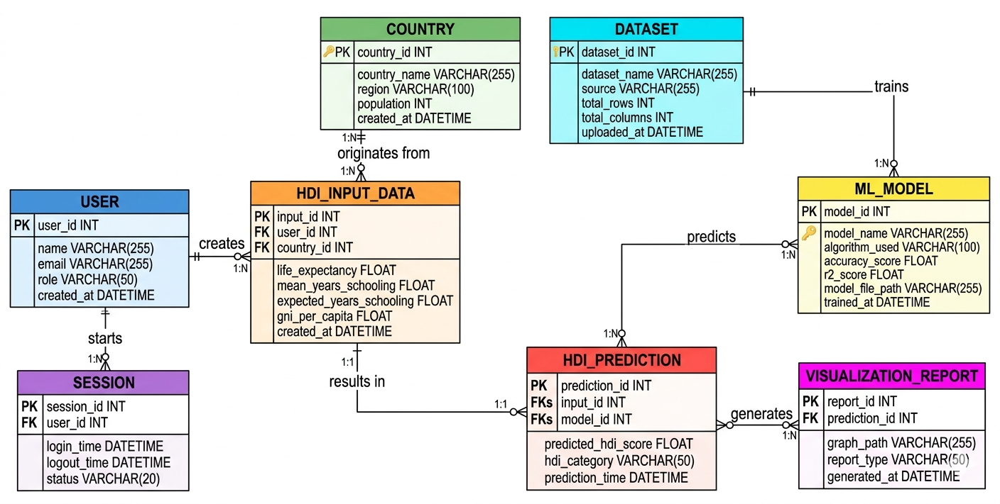
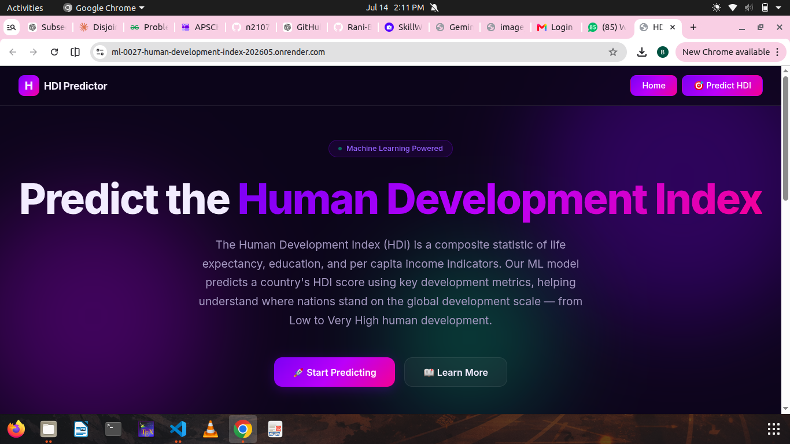
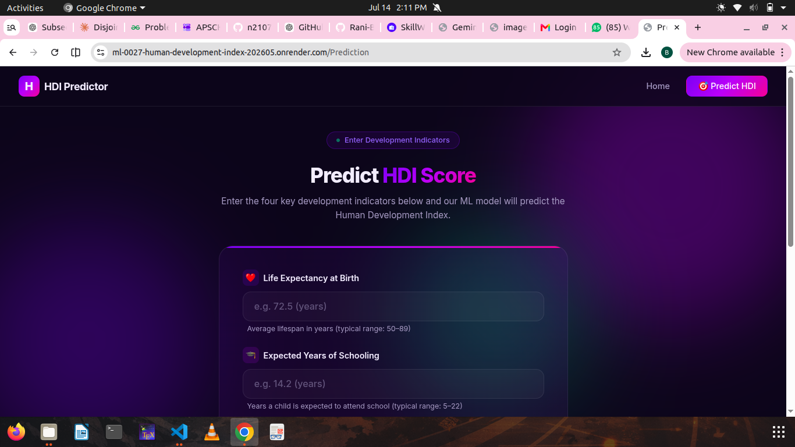
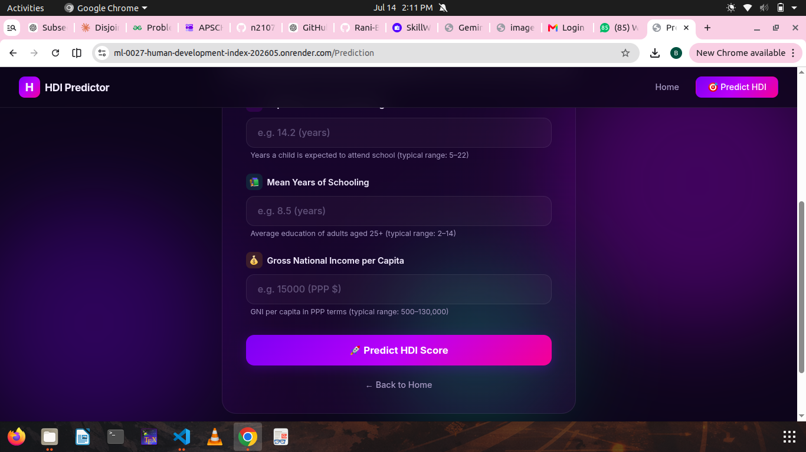
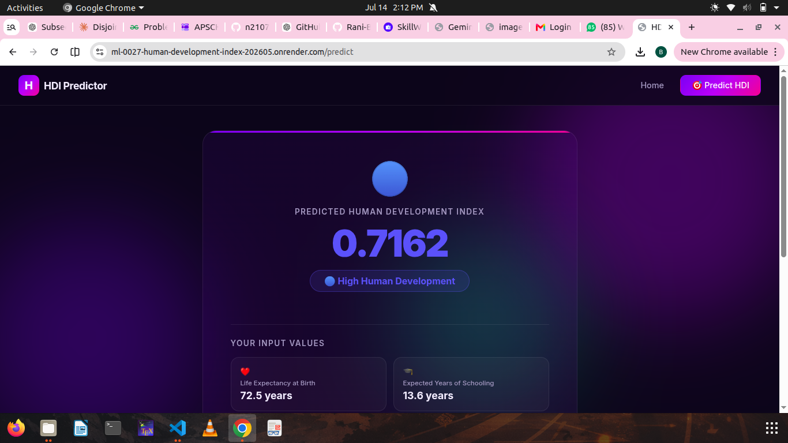
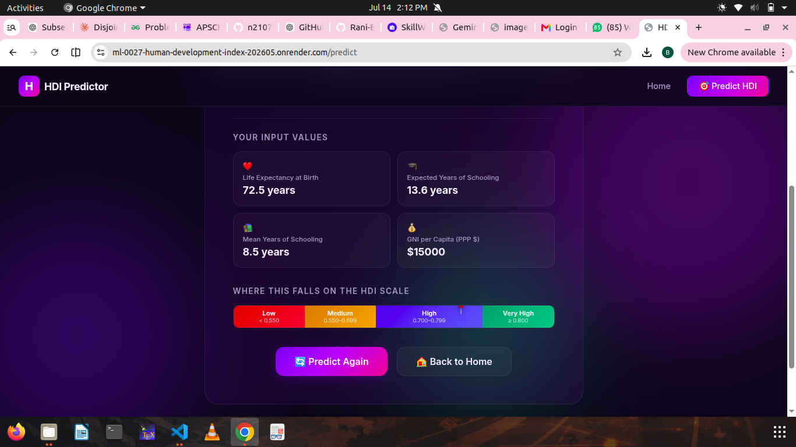

# 🌍 Human Development Index (HDI) Prediction System

<p align="center">


</p>

An end-to-end Machine Learning web application that predicts the **Human Development Index (HDI)** of a country using socio-economic indicators such as life expectancy, education, and Gross National Income (GNI) per capita.

The application combines **data preprocessing**, **machine learning**, and **Flask-based deployment** to provide real-time HDI predictions through an intuitive web interface.

---

# 📑 Table of Contents

- Overview
- Features
- Technology Stack
- System Architecture
- Workflow
- Machine Learning Pipeline
- Dataset
- Project Structure
- ER Diagram
- Screenshots
- Installation
- Usage
- Future Enhancements
- Team
- License

---

# 📖 Overview

The Human Development Index (HDI) is a composite statistic developed by the United Nations Development Programme (UNDP) to measure a country's overall development.

This project predicts HDI using a trained Machine Learning model by analyzing key socio-economic indicators.

The project demonstrates the complete lifecycle of a Machine Learning application, including:

- Data Collection
- Data Analysis
- Data Preprocessing
- Model Training
- Model Evaluation
- Model Serialization
- Flask Deployment

---

# ✨ Features

- 🌍 HDI Prediction
- 📊 Exploratory Data Analysis
- 🧹 Data Preprocessing
- 🤖 Machine Learning Model
- 🌐 Flask Web Interface
- 📈 Real-time Prediction
- 💾 Pickle Model Storage

---

# 🛠 Technology Stack

| Category | Technologies |
|-----------|--------------|
| Programming | Python |
| Backend | Flask |
| Machine Learning | Scikit-Learn |
| Data Analysis | Pandas, NumPy |
| Visualization | Matplotlib, Seaborn |
| Model Storage | Pickle |
| Frontend | HTML, CSS |

---

# 🏗️ System Architecture

<p align="center">



</p>

The architecture consists of:

- User Layer
- Frontend Layer
- Flask Backend
- Machine Learning Pipeline
- Prediction Engine
- Model Storage Layer

---

# 🔄 Project Workflow

<p align="center">


</p>

The workflow followed by the system is:

1. Dataset Collection
2. Exploratory Data Analysis
3. Data Cleaning
4. Feature Engineering
5. Train-Test Split
6. Model Training
7. Model Evaluation
8. Model Serialization
9. Flask Integration
10. Real-time Prediction

---

# 🤖 Machine Learning Pipeline

```text
HDI Dataset
      │
      ▼
Exploratory Data Analysis
      │
      ▼
Data Cleaning
      │
      ▼
Feature Engineering
      │
      ▼
Train-Test Split
      │
      ▼
Linear Regression Model
      │
      ▼
Model Evaluation
      │
      ▼
Pickle Serialization
      │
      ▼
Flask Web Application
      │
      ▼
HDI Prediction
```

---

# 📊 Dataset

The model is trained using an HDI dataset containing:

- Country
- Life Expectancy
- Mean Years of Schooling
- Expected Years of Schooling
- Gross National Income (GNI)
- HDI Score

---

# 📂 Project Structure

```text
Human-Development-Index/

├── Dataset/
├── Flask/
│   ├── app.py
│   ├── HDI.pkl
│   ├── templates/
│   └── requirements.txt
│
├── Training/
│
├── 8.Docs/
│   ├── Architecture.png
│   ├── Workflow.png
│   ├── ER_Diagram.png
│   ├── Home.png
│   ├── Prediction1.png
│   ├── Prediction2.png
│   ├── Result1.png
│   └── Result2.png
│
└── README.md
```

---

# 🗄️ Entity Relationship Diagram

<p align="center">



</p>

The system consists of the following core entities:

- User
- Country
- Dataset
- HDI Input
- ML Model
- Prediction
- Visualization Report
- Session

---

# 📸 Application Screenshots

## Home Page

<p align="center">



</p>

---

## Prediction Interface

<p align="center">




</p>

---

## Prediction Result

<p align="center">




</p>

---

# 🚀 Installation

Clone the repository

```bash
git clone https://github.com/Rani-Boora/Human-Development-Index.git
```

Navigate into the project directory

```bash
cd Human-Development-Index
```

Install dependencies

```bash
pip install -r Flask/requirements.txt
```

Run the application

```bash
cd Flask
python app.py
```

Open your browser and visit:

```text
http://127.0.0.1:5000
```

---

# 💻 Usage

1. Launch the Flask application.
2. Enter the required socio-economic indicators.
3. Submit the form.
4. The trained model predicts the HDI score.
5. The predicted HDI category is displayed instantly.

---

# 🎯 Skills Demonstrated

- Machine Learning
- Linear Regression
- Data Analysis
- Exploratory Data Analysis
- Feature Engineering
- Flask Development
- Model Deployment
- Git & GitHub

---

# 🚀 Future Enhancements

- Random Forest & XGBoost models
- Interactive Dashboard
- REST API
- Docker Support
- Cloud Deployment
- User Authentication

---

# 👥 Team

| Name | Role |
|------|------|
| **Rani Boora** | Flask Development, Integration, Testing |
| **Lakshmi Boora** | Machine Learning, Data Analysis |
| Badiginchala Hazi Divya | Team Member |
| Chandra Bharath | Team Member |
| Udayteja Gorli | Team Member |
| Guttula Viswa Vanitha | Team Member |

---

# 📄 License

## 📄 Disclaimer

This project was developed as part of an academic learning initiative for educational purposes. It demonstrates the application of Machine Learning and Flask in predicting the Human Development Index (HDI). The project is intended for learning, experimentation, and portfolio presentation.